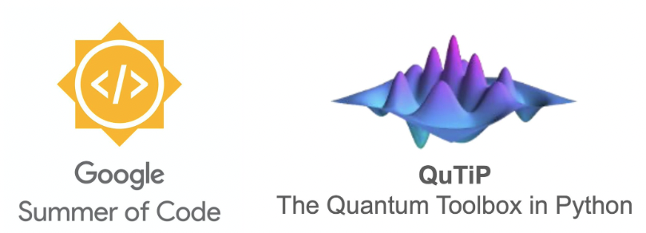

# Welcome to My GSoC 2026 Journey

Hi, I'm **Chinmay Tangal** – a Computer Engineering undergrad with a growing interest in high-performance computing, open quantum systems, and open-source scientific software. I'm excited to be part of **Google Summer of Code 2026** with NumFOCUS, working on a project that sits right at the intersection of quantum physics and systems-level computing.

This blog is where I'll document my GSoC experience, the technical problems I run into, and how I'm thinking through building a cluster-ready quantum solver.

{width=75% fig-align="center"}

## About the Project

### Large Scale HEOM Solver Using PETSc

I'm building a distributed HEOM solver for [QuTiP](https://qutip.org/) (Quantum Toolbox in Python). HEOM — the Hierarchical Equations of Motion — is one of the few methods that can exactly simulate open quantum system dynamics without Markov or perturbative approximations. The catch is that it's expensive: memory and compute blow up fast as hierarchy depth or system size grows. The current QuTiP implementation runs on a single node, which puts a hard ceiling on what's realistically solvable.

**What I'm Building:**

- A distributed execution path for the HEOM solver using PETSc and MPI, so the ODE integration can run across multiple nodes on an HPC cluster
- A careful distributed data layout for the hierarchy that keeps inter-rank communication manageable
- Correctness validation against the existing solver on standard benchmark systems
- Performance benchmarks across hierarchy depths, system sizes, and node counts
- Documentation and tutorials for running the solver on real HPC infrastructure

**Technologies & Tools:**

- **Primary:** Python, PETSc, MPI, QuTiP, SciPy
- **Development:** Git, GitHub, Jupyter Notebooks
- **Documentation:** LaTeX, Matplotlib
- **Testing:** pytest framework

**Mentors:** Alex Pitchford, Emil VATAI, Neill Lambert

The existing solver stays completely untouched — users who don't need distributed execution shouldn't have to think about any of this.

🔗 **[View Project Details on GSoC Website](https://summerofcode.withgoogle.com/)**

## Recent Posts

### 🎉 Exciting News: I'm Joining Google Summer of Code 2026!
*May 2026*

I'd been contributing to QuTiP for a few months when I decided to put together a GSoC proposal. I didn't expect it to go anywhere — but here we are...

[Read more →](posts/intro/gsoc-selection.qmd)

## About This Site

This site is built with [Quarto](https://quarto.org) and hosted on GitHub Pages. It's part technical blog, part development log for everything happening during this project.

**Topics I write about:**

- Open quantum systems and simulation
- High-performance and distributed computing
- Open source development
- Python and C programming
- GSoC 2026 journey
- Technical tutorials and HPC workflows

---

*Last updated: June 2026*