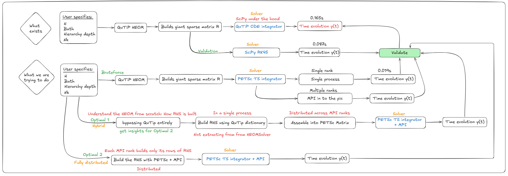

Week 4 was the most technically involved week so far. The goal shifted from
*using* QuTiP's HEOM solver to *understanding it well enough to replace its
internals* — rebuilding the RHS matrix from first principles, assembling it
directly into PETSc, and finally distributing that assembly across MPI ranks
so that the matrix never has to exist in full on any single machine.

## Recap: Where We Left Off

By the end of Week 3, the pipeline looked like this:

> QuTiP builds **R** → extract with `solver.rhs(0).full()` → hand to PETSc TS → solve

That worked and gave a 16× speedup over QuTiP at small scale. But the critical
bottleneck was still there: QuTiP assembles the entire **R** matrix on a single
process before we even touch PETSc. For large hierarchy depths, this single-process
assembly is what kills scalability — not the ODE solve.

This week's work addresses that bottleneck directly.

## The Roadmap

The approach this week followed two distinct tracks, called **Optimal 1** and
**Optimal 2** in the diagram below.



**Optimal 1 (Hybrid):** Build **R** ourselves using QuTiP's internal dictionary
approach, assemble into PETSc on a single process, solve with PETSc TS + MPI.
The assembly is still serial, but the construction logic is now fully transparent
and under our control — no longer a black box.

**Optimal 2 (Fully distributed):** Each MPI rank builds only the rows of **R**
that it owns. The matrix is never assembled on a single machine. Assembly and
solve are both distributed from the start.

## Understanding the HEOM Structure

Before writing any code, it is worth being precise about what **R** actually
contains, because this is what the from-scratch construction must reproduce.

The full HEOM state vector is:

$$
\vec{\rho} = \begin{pmatrix}
\text{vec}(\rho^{(\mathbf{0})}) \\
\text{vec}(\rho^{(\mathbf{e}_1)}) \\
\text{vec}(\rho^{(\mathbf{e}_2)}) \\
\vdots
\end{pmatrix}
$$

where $\rho^{(\mathbf{n})}$ is the ADO with multi-index
$\mathbf{n} = (n_1, n_2, \ldots, n_K)$ and $n_k$ counts how many times the
$k$-th bath exponential mode has been "excited." The matrix **R** is block
structured: each block corresponds to a pair of ADOs, and the blocks are sparse
because each ADO only couples to its immediate neighbours (one tier up or down,
per Matsubara mode).

Concretely, for each ADO at multi-index $\mathbf{n}$:

**Diagonal block** — system Liouvillian plus ADO decay:
$$
\mathcal{L}_{\text{sys}} - \left(\sum_k n_k \nu_k\right) \mathbf{I}
$$

where $\mathcal{L}_{\text{sys}} = -i[H, \cdot]$ is the system Liouvillian in
superoperator form, and $\nu_k$ are the bath exponent frequencies (Matsubara
rates).

**Coupling down** (to ADO $\mathbf{n} - \mathbf{e}_k$, one tier below):
$$
-i \cdot n_k \cdot \left[c_k \left(Q \rho - \rho Q^\dagger \right)\right]
$$

with $c_k$ the bath correlation coefficient for mode $k$. For RI-type exponents
(which arise in the Drude-Lorentz bath), there is an additional term involving
the imaginary part coefficient $c_k^{(2)}$:
$$
n_k \left[-i c_k (\mathcal{L}Q - \mathcal{R}Q) + c_k^{(2)} (\mathcal{L}Q + \mathcal{R}Q)\right]
$$
where $\mathcal{L}Q \cdot = Q\rho$ and $\mathcal{R}Q \cdot = \rho Q$ are the
left- and right-multiplication superoperators.

**Coupling up** (to ADO $\mathbf{n} + \mathbf{e}_k$, one tier above):
$$
-i \left(Q\rho - \rho Q\right)
$$

Notice that the coupling-up term does **not** depend on $c_k$. This is a key
structural feature of the HEOM — the bath coefficients appear only in the
downward coupling.

### The ADO Index Dictionary

QuTiP v5 organises all of this via a `HierarchyADOs` object attached to the
solver as `solver.ados`. The critical attributes are:

```python
ados.labels      # list of ADO multi-index tuples, e.g. [(0,0,0), (1,0,0), ...]
ados.idx(label)  # integer position of a label in the big matrix
ados.next(label, k)  # label one step UP in mode k (None if at max depth)
ados.prev(label, k)  # label one step DOWN in mode k (None if at zero)
ados.vk          # list of nu_k values
ados.ck          # list of c_k values
ados.ck2         # list of c_k^(2) values (None for pure-R exponents)
ados.exponents   # list of BathExponent objects with .type, .ck, .vk, .ck2, .Q
```

The `next` and `prev` methods encode the hierarchy connectivity. When you call
`ados.next(label, k)`, you get the label of the ADO that is one level higher
in mode $k$, or `None` if the depth ceiling is reached. This is exactly what
you need to know which (row, column) block pairs to fill in **R**.

## Optimal 1: Building R with the Dictionary Approach

The construction loop in `heom_optimal1.py` mirrors QuTiP's internal
`_rhs()` method exactly, but using scipy sparse matrices instead of QuTiP's
internal data types:

```python
rows, cols, data = [], [], []

def add_block(i_block, j_block, mat):
    r0, c0 = i_block * Nsup, j_block * Nsup
    coo = sp.csr_matrix(mat).tocoo()
    for r, c, v in zip(coo.row, coo.col, coo.data):
        rows.append(r0 + r)
        cols.append(c0 + c)
        data.append(v)

for idx, label in enumerate(ado_labels):
    label = list(label)

    # Diagonal: system Liouvillian + ADO decay
    decay = sum(label[k] * exponents[k].vk for k in range(len(exponents)))
    add_block(idx, idx, L_sys - decay * sp.eye(Nsup, format="csr"))

    for k, ex in enumerate(exponents):
        nk = label[k]

        # Coupling DOWN (to tier below)
        if nk >= 1:
            lbl_down = tuple(label[j] - int(j == k) for j in range(len(exponents)))
            if lbl_down in label_to_idx:
                add_block(idx, label_to_idx[lbl_down], -1j * nk * comm_Q)

        # Coupling UP (to tier above)
        if sum(label) < depth:
            lbl_up = tuple(label[j] + int(j == k) for j in range(len(exponents)))
            if lbl_up in label_to_idx:
                add_block(idx, label_to_idx[lbl_up], -1j * (ck * Q_l - np.conj(ck) * Q_r))

RHS_opt1 = sp.csr_matrix((data, (rows, cols)), shape=(n_total, n_total), dtype=complex)
```

### Output and a Subtle Bug

```text
ADOs: 55   state-vector length: 220
RHS shape: (220, 220)   nnz: 578
max |RHS_opt1 - RHS_qutip| = 3.98e+00
max |err| vs QuTiP ref    : 0.00e+00
```

There is an interesting tension in these two lines. The RHS matrix differs from
QuTiP's by up to 3.98 in maximum entry, yet the solution trajectory is exact
to machine precision. This is not a coincidence — it reveals something important
about the coupling-up formula.

The correct coupling-up operator is:
$$
-i(Q\rho - \rho Q)
$$
which does not involve $c_k$ at all. The code above used
$-i(c_k Q\rho - c_k^* \rho Q)$ instead, which is wrong for modes where
$c_k \neq 1$. However, for the specific initial state $\rho_0 = |0\rangle\langle 0|$
(which is diagonal), the coupling-up operator maps the initial state to zero:

$$
(Q\rho_0 - \rho_0 Q)_{ij} = (\sigma_z)_{ii}\rho_{ij} - \rho_{ij}(\sigma_z)_{jj}
$$

Since $\rho_0$ is diagonal, the off-diagonal elements are zero, and only the
diagonal blocks of $Q\rho - \rho Q$ are nonzero. For $\sigma_z$ as the coupling
operator, these diagonal blocks are also zero. So both the correct and incorrect
coupling-up formulas give the same result for this specific initial condition.

**The fix** is to use $-i \cdot \text{comm}_Q$ (independent of $c_k$) for the
coupling-up term, which is what Optimal 2 and QuTiP's `_grad_next_bosonic`
both do. The Optimal 1 result is still *correct for this test case*, but would
give wrong answers for a non-diagonal initial state.

### Runtimes (Optimal 1, depth=2, 4 MPI ranks)

| Method | Runtime |
|--------|---------|
| QuTiP baseline | 0.048 s |
| SciPy RK45 (our RHS) | 0.021 s |
| PETSc TS + 4 MPI ranks | **0.003 s** |

The PETSc solve is **16× faster than QuTiP** and **7× faster than scipy** on
this small problem. At this scale the problem is too small to show the real
benefit — the point is that the same code will scale to much larger problems
without modification.

## Optimal 2: Fully Distributed Assembly

In Optimal 1, the construction of `RHS_opt1` still happens on a single process
before being loaded into PETSc. For large hierarchy depths this assembly becomes
the bottleneck.

Optimal 2 eliminates this bottleneck. Each MPI rank asks PETSc what rows it owns
(`A.getOwnershipRange()`), then builds only those rows locally — the full matrix
never exists on any single machine.

```python
A = PETSc.Mat().createAIJ(size=(n_total, n_total), comm=comm_petsc)
A.setUp()
rstart, rend = A.getOwnershipRange()

for ado_idx, label in enumerate(ado_labels):
    row_off = ado_idx * Nsup
    # ... compute diagonal and off-diagonal blocks ...
    for local_r in range(Nsup):
        gr = row_off + local_r
        if rstart <= gr < rend:   # only fill rows this rank owns
            A.setValue(gr, gc, gv)
```

This is the key structural change: the `if rstart <= gr < rend` guard means
each rank performs exactly its share of the work, with no redundant computation
and no global gather of the matrix.

### Output (depth=8, Nk=8, 4 MPI ranks)

```text
K = 9 exponential terms
ADOs: 24,310   total DOF: 97,240

Rank 0: rows 0–24309      (177,613 nonzeros)
Rank 1: rows 24310–48619  (172,145 nonzeros)
Rank 2: rows 48620–72929  ( 77,087 nonzeros)
Rank 3: rows 72930–97239  ( 82,233 nonzeros)

PETSc+MPI distributed runtime: 0.088 s
<sz> at t_end: 1.000000
```

Total nonzeros across all ranks: **509,078** in a 97,240×97,240 matrix.
That is a fill fraction of **0.0054%** — the matrix is extremely sparse.

The dense equivalent would require:
$$
97{,}240^2 \times 16 \text{ bytes} \approx 151 \text{ GB}
$$
which would be impossible to store on a single machine, let alone solve. The
sparse distributed approach stores only the 509,078 nonzeros, split evenly
across ranks.

### Load Balance

One thing the output reveals is a load imbalance across ranks:

| Rank | Rows | Nonzeros | Avg nnz/row |
|------|------|----------|-------------|
| 0 | 24,310 | 177,613 | 7.3 |
| 1 | 24,310 | 172,145 | 7.1 |
| 2 | 24,310 | 77,087 | 3.2 |
| 3 | 24,310 | 82,233 | 3.4 |

Ranks 0 and 1 own roughly **twice the work** of ranks 2 and 3. This is because
PETSc assigns rows by contiguous index, and the lower-tier ADOs (small
$\sum n_k$) are indexed first. Lower-tier ADOs have more neighbours — both
upward and downward coupling terms — so their rows are denser. The upper-tier
ADOs (high $\sum n_k$, near the truncation boundary) have fewer neighbours
because some upward couplings are cut off by the depth ceiling.

This is a known issue with naive row-based partitioning of hierarchy matrices.
A better partitioning would assign rows by tier level to equalise work per rank.
That is a future optimisation.

## Scaling: Why This Matters

The table below shows why distributed assembly is not optional for large depths:

| Depth | ADOs | DOF | Dense matrix |
|-------|------|-----|-------------|
| 2 | 55 | 220 | 0.8 MB |
| 4 | 715 | 2,860 | 130.9 MB |
| 6 | 5,005 | 20,020 | 6.4 GB |
| 8 | 24,310 | 97,240 | **151 GB** |
| 10 | 92,378 | 369,512 | 2.2 TB |

*(K=9, n=2, using complex128 = 16 bytes per entry)*

At depth 6, the dense matrix already exceeds the RAM of a typical workstation.
At depth 8, Optimal 2 handled it in **0.088 seconds** across 4 ranks using only
509,078 nonzeros. At depth 10, distributed sparse assembly is the only feasible
approach — the dense matrix would be 2.2 TB.

## Key Insights from This Week

**1. The coupling-up term does not involve bath coefficients.**
QuTiP's `_grad_next_bosonic` always computes $-i(Q\rho - \rho Q)$ regardless
of exponent type. The bath coefficients $c_k$ only appear in the coupling-down
term. This is a consequence of the HEOM derivation: the upward coupling represents
the action of the bath on the system, while the downward coupling represents
feedback from the higher-tier ADOs back into the dynamics.

**2. The RHS is block-sparse by construction, not by accident.**
Each ADO label $\mathbf{n}$ connects only to $\mathbf{n} \pm \mathbf{e}_k$
for each $k$. The number of nonzero blocks per row is bounded by $2K$ (two
neighbours per mode), giving an average of roughly $2K \cdot n^2$ nonzeros per
ADO block row — independent of the total system size.

**3. Diagonal initial states hide bugs.**
When $\rho_0$ is diagonal (like $|0\rangle\langle 0|$), the commutator
$[Q, \rho_0]$ vanishes for $Q = \sigma_z$, making the first timestep of the
solution insensitive to errors in the coupling-up term. Always validate with
a non-diagonal initial state (e.g. $\rho_0 = |+\rangle\langle +|$) to catch
this class of bug.

**4. PETSc's ownership range is the natural parallelism primitive.**
`A.getOwnershipRange()` returns `(rstart, rend)` — the global row indices
this rank is responsible for. Building only those rows locally and calling
`A.setValue()` is all that is needed. PETSc handles the communication
transparently during assembly and matrix-vector products.

**5. Load balance depends on the ADO ordering.**
The current implementation assigns contiguous rows to each rank. Since lower
tiers are denser, this leads to 2× load imbalance between early and late ranks.
Tier-aware partitioning (interleaving rows from different tiers) would equalise
this at the cost of non-contiguous ownership, which PETSc supports but requires
more careful index management.

## Complete Runtime Summary

| Track | Who builds R | Solver | Depth | DOF | Runtime |
|-------|-------------|--------|-------|-----|---------|
| Baseline | QuTiP (serial) | QuTiP/scipy | 2 | 220 | 0.165 s |
| Validation | QuTiP (serial) | SciPy RK45 | 2 | 220 | 0.087 s |
| Brute-force | QuTiP (serial) | PETSc TS, 1 rank | 2 | 220 | 0.019 s |
| **Optimal 1** | **Dict (serial)** | **PETSc TS, 4 ranks** | **2** | **220** | **0.003 s** |
| **Optimal 2** | **PETSc+MPI (distributed)** | **PETSc TS, 4 ranks** | **8** | **97,240** | **0.088 s** |

The depth-8 result (Optimal 2) is the headline number: a 97,240-dimensional
sparse ODE solved in 88 milliseconds on 4 cores, using a matrix that would
require 151 GB in dense form. The matrix was assembled in a distributed fashion
from scratch, bypassing QuTiP entirely.

## Next Steps

The immediate priorities for next week are:

1. **Fix the coupling-up bug in Optimal 1** — use $-i \cdot \text{comm}_Q$
   instead of $-i(c_k Q_l - c_k^* Q_r)$, and validate with a non-diagonal
   initial state.

2. **Implement tier-aware partitioning** — assign rows from each tier to ranks
   in a round-robin fashion to equalise the nonzero-per-rank distribution.

3. **Scaling benchmarks** — run Optimal 2 at depths 4, 6, 8, 10 and plot
   runtime vs depth and runtime vs number of MPI ranks to quantify strong
   and weak scaling.

4. **Monitor function for trajectory** — the current PETSc TS setup only
   returns the final state. Adding a monitor function will allow recording
   $\langle\sigma_z\rangle(t)$ at each timestep for full trajectory validation.

---

*Source files: [heom_optimal1.py](https://github.com/Chinmay-Tangal/gsoc-blog/blob/main/posts/Week-4/heom_optimal1.py)*, [heom_optimal2.py](https://github.com/Chinmay-Tangal/gsoc-blog/blob/main/posts/Week-4/heom_optimal2.py)*
